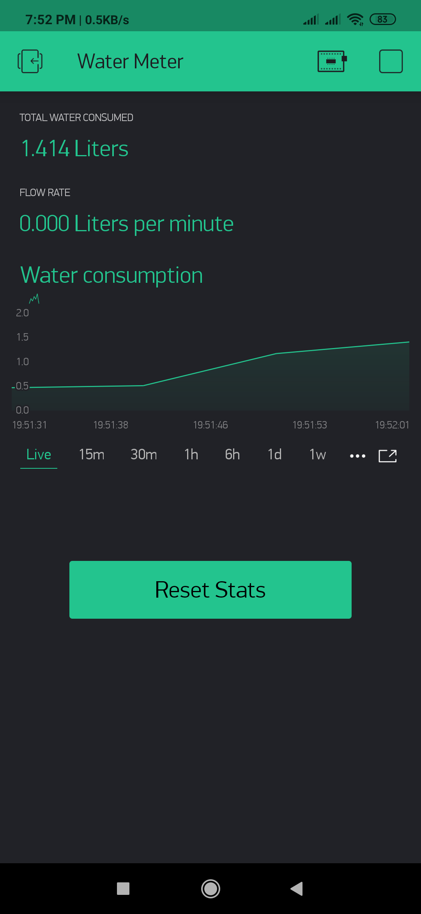
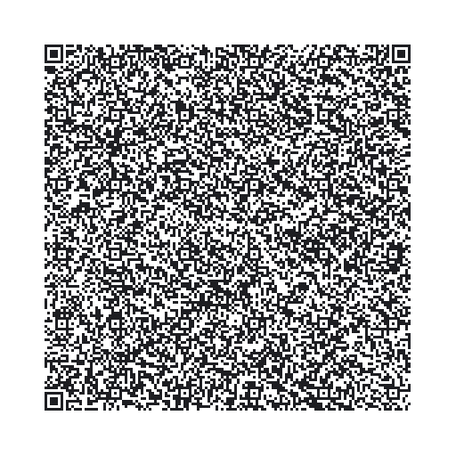

# Blynk Flow Sensor Water Meter

Blynk flow sensor water meter to measure total water consumption. 

<h2> Requirements</h2>
1) Blynk App  
2) Water Flow Sensor (I used YF-S201B) 
3) NodeMCU  

<h2> Installation </h2>

Open settings.h and change Bynk Auth code, Wifi settings, server settings and flow calibration. 

<h2> Hardware Connection </h2>

<b>Flow Sensor to NodeMCU</b>

Yellow Wire (Signal Pin) to NodeMCU D2 Pin  
Red Wire to NodeMCU 3.3V Pin 
Black Wire to NodeMCU Gnd Pin 

<h2>Software Setup</h2>
1) Download and install the Blynk Mobile App for iOS or Android.   
2) Scan the QR code at the bottom of this page to clone the screenshot below, or create a new project yourself and manually arrange and setup the widgets.  
3) Email yourself the Auth code.  
4) Download this repo and copy the files in to your sketches directory. Open the sketch in Arduino IDE.  
5) Go to the settings.h tab. This is where all the customisable settings are. You should be able to change almost everything from there before compiling.  

<h2> Screenshot</h2>

<h2> Scan QR Code on Blynk App </h2>

